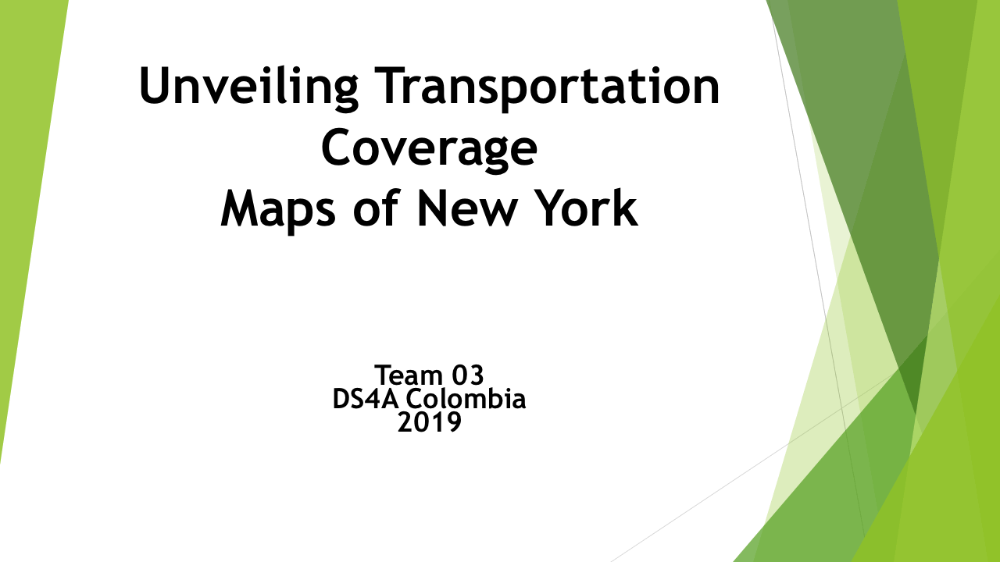

# DS4A_Datathon_Team03_2019:  Datathon Group 3: December 2019

Mapa Integrado Información de Riesgo - Integrated Risk Information Map:

Johnathan Salamanca, Mario Cerón, Carol Martinez, Javier Cocunubo, Jairo Niño, Alvaro Muñoz

#Repositories: 

https://github.com/marioceron/DS4A_Datathon_Team03_2019/

https://github.com/jssalamanca1967/ds4a_datathon_group03/

# Folders:

# /code
* Relevant jupyter notebooks converted to HTML for each analysis

# /Dataset: 
* Parquet files for dataset of weather

# /ER_Model_Data_Schema: 
* Entity Relationship Model for Database ER

# /latexDocuments: 
* /datathon: Reports and images in Latex format and PDF format: datathon_Final_team03.pdf

# /presentation: 
* pptx presentation: Datathon_presentation.pptx

# /Results: 
* /Images: All images generated from the jupyter notebooks

* /Maps: All Generated Maps in HTML format 

# /root files: 
* Source code of jupyter notebook per each analysis.

